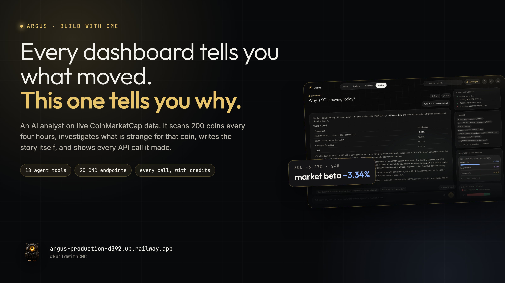
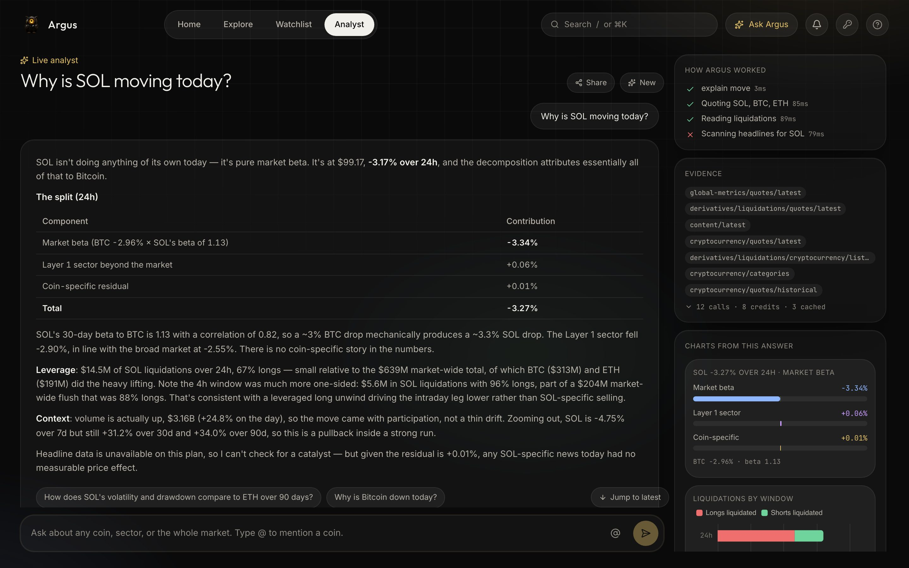

# Argus

**A crypto market terminal with an AI analyst built in, running on live CoinMarketCap data.**

Argus is a full web app: a market dashboard, a coin explorer, coin pages with computed risk
profiles, a watchlist with correlation analysis, and an analyst you can ask questions in
plain language. The analyst is a Claude agent with 19 tools over the CoinMarketCap API. It
decides which endpoints answer a question, calls them, computes what the API does not
provide, and shows every call it made. On its own, Argus scans the top 200 every four hours,
flags moves that are unusual for that coin, investigates them and writes the headline; and
twice a day it writes a market brief without anyone typing a prompt.

Built for the [Build with CMC: API Hackathon](https://dorahacks.io/hackathon/coinmarketcap-api-202609/detail),
track **AI Agents and Automation**. Live: **https://argus-production-d392.up.railway.app**
Two-minute demo: **https://youtu.be/eG0nNZ3ARUE**



## Screens

| Screen | What it shows |
|---|---|
| **Home** | Total cap, volume, BTC dominance with sparklines; Fear & Greed and Altcoin Season gauges; "Argus noticed", a coverflow of agent-investigated findings with Read more and Ask Argus; a Move explainer that attributes any coin's move to market beta, sector and coin-specific factors; the 90-day cap and dominance chart beside the brief deck; long vs short liquidations; liquid movers. |
| **Explore** | Top 200 coins with price, 24h and 7d change, market cap, volume, 7-day sparklines, sortable columns, and filters for cap size, DeFi, Layer 1, AI, memes and stablecoins. |
| **Coin** | Price and volume chart with 24h to 1y ranges (candles where the plan allows), key stats, ATH distance, a 90-day risk profile (return, volatility, drawdown, correlation with BTC), project info, and an inline analyst with prefilled questions. |
| **Watchlist** | Saved coins, a rebased relative-performance chart and a correlation heatmap for any selection. |
| **Portfolio** | A tab on the Watchlist screen. Put an amount next to any coin and Argus prices the basket, splits today's move into market beta, sector and what is specific to your positions, charts the basket against Bitcoin, and measures concentration, sector exposure and 90-day risk. Amounts live in the browser. |
| **Analyst** | The full agent: streaming answers, inline charts for risk, history, attribution and liquidations, model-proposed follow-up questions, a fixed rail with tool steps and every CoinMarketCap call with its credit cost and response, conversation history saved on device, and read-only share links (`/s/:id`). |
| **Status** | Plan tier and credit usage, a live probe of which endpoint families the key can reach, brief and watch-loop state, a pause switch for the automation, and the recent call log. |

Also: a first-run welcome tour with the Argus owl, a Cmd+K command palette (coins, screens, saved questions), local price and Fear & Greed alerts with browser notifications, a floating tab bar on phones, and copy-as-markdown on answers and the brief.

## What the agent does that a plain API call cannot

| Question | What Argus does |
|---|---|
| "Why is X moving?" | Pulls the coin's quote and candles, its sector peers, market backdrop, liquidations and headlines, then separates coin-specific moves from market beta. |
| "Compare BTC, ETH and SOL risk" | Fetches daily history for each and computes return, max drawdown, annualized volatility, best and worst day, volume trend, and correlation with BTC. |
| "Which sectors are rotating?" | Reads all categories, ranks by market cap and volume change, then drills into the constituents of the movers. |
| "Is it altseason?" | Combines the Altcoin Season Index, BTC dominance and its 24h change, and Fear & Greed into one read. |
| "Why is my portfolio down?" | Prices the person's holdings, applies the same attribution to the whole basket, names the positions that drove it, and compares with simply holding Bitcoin ([src/services/portfolio.ts](src/services/portfolio.ts)). CoinMarketCap has no holdings endpoint; the amounts come from the browser and the analysis is all derived. |
| Automated brief | Twice a day the agent writes a structured brief: backdrop, movers, sector rotation, leverage and risk, watch list. Shown on the home screen as a sliding card deck. |
| Watch loop | Every four hours a pure detector scores the top 200 against each coin's own hourly volatility ([src/services/watch.ts](src/services/watch.ts)). Flags get an agent investigation with a headline, deck and article, subject to cooldowns and a daily cap. |
| Move attribution | `explain_move` computes the coin's beta to BTC over 30 days, splits the move into market, sector-excess and coin-specific parts, and adds the liquidation picture ([src/services/explain.ts](src/services/explain.ts)). Deterministic, so the same question gives the same numbers. |

## Quick start

```bash
pnpm install                 # installs server and web dependencies
cp .env.example .env         # add CMC_API_KEY and ANTHROPIC_API_KEY
pnpm dev                     # API + agent on http://localhost:3100
pnpm dev:web                 # web app on http://localhost:5173 (proxies /api)
```

Command line:

```bash
pnpm ask "why is SOL moving today"
pnpm brief                   # market brief to stdout
pnpm ask --keyinfo           # your CMC plan and remaining credits
```

Production:

```bash
pnpm build && pnpm start     # serves the built app and API on one port
docker build -t argus . && docker run -p 3100:3100 --env-file .env argus
railway up                   # deploys with railway.json; mount a volume at /app/.cache
```

Without `CMC_API_KEY`, Argus falls back to CMC's keyless public API for the endpoints it
supports. On the free Basic plan, OHLCV, trending, gainers/losers and news return error
1006; Argus detects that and degrades: candles come from `/v3/cryptocurrency/quotes/historical`
(daily closes), movers from a filtered listings screen sorted locally. The UI and the
agent both say which source was used.

## Keys: shared or bring your own

The market screens need no Anthropic key. The analyst, Ask Argus and Scan now run on
Claude, which bills one. Two ways to provide it:

- **Shared:** set `ANTHROPIC_API_KEY` on the server and every visitor uses it. The pause
  switch on `/status`, `WATCH_MAX_PER_DAY` and a spend limit on the Anthropic workspace
  bound the cost.
- **Bring your own:** visitors paste a key on `/keys`. It is tested with a one-token request,
  saved in that browser's local storage only, and sent as the `x-anthropic-key` header with
  each question. The server uses it for that request and never logs or stores it
  ([src/services/keys.ts](src/services/keys.ts)). The scheduled brief and watch loop only
  ever use the server key. With no server key, the Analyst shows a connect card instead of
  an error, and `POST /api/chat` and `POST /api/watch/scan` return 401 `no_key`.

## Friendly by design

- **Tap any jargon.** Dotted-underlined terms such as BTC dominance, Fear & Greed, liquidations and market beta open a one-line plain explanation.
- **Explain, instantly.** Home tiles, gauges, the market chart, movers, liquidations, coin risk stats and portfolio cards carry an Explain button. It opens a stored explainer, with no AI call and no wait: what today's value means, how it compares with a week ago, when it was read, a scale where one applies, how to read it and what moves it. Dominance and liquidations add a separate link to the analyst for the "why today" question.
- **Learn.** Every explainer on one page at `/learn`, linked from each popup and the search palette.
- **Scan now on your own key.** Scheduled scans run every four hours on the site's key. A visitor can scan on demand with their own key, which stays in their browser and is never stored in a database.
- **Paste your portfolio.** Type "0.5 BTC, 10 SOL" instead of filling amounts row by row. Matches are previewed before they are added.
- **Calm mode.** Stops the carousels from sliding on their own, and follows the device's reduce-motion setting by default.
- **Honest failure.** A free probe checks the site's Anthropic key at boot, every 30 minutes and after any auth error. If Anthropic rejects it, a banner says so and points to bringing your own key.
- **Owner-only switches.** Set `ARGUS_ADMIN_TOKEN` and pausing automation or forcing a brief needs it in the `x-admin-token` header. Status asks for it once and remembers it in that browser.
- **Spend you can see.** Status estimates what the site's Anthropic key spent today and this week, by analyst questions, briefs, investigations and headlines. Questions on the shared key are capped per visitor per hour and per day (`ANALYST_SHARED_PER_HOUR`, `ANALYST_SHARED_PER_DAY`); visitors with their own key have no cap.

## CoinMarketCap endpoints used

All under `https://pro-api.coinmarketcap.com`, authenticated with `X-CMC_PRO_API_KEY`.

| Endpoint | Used for |
|---|---|
| `GET /v1/cryptocurrency/map` | Resolve symbols to ids, search |
| `GET /v3/cryptocurrency/quotes/latest` | Live price, volume, cap, dominance, % changes |
| `GET /v3/cryptocurrency/listings/latest` | Ranked market lists and screens |
| `GET /v3/cryptocurrency/quotes/historical` | Daily and hourly history, sparklines, risk maths |
| `GET /v2/cryptocurrency/info` | Project metadata and links |
| `GET /v1/cryptocurrency/categories` | Sector market cap and volume changes |
| `GET /v1/cryptocurrency/category` | Constituents of a sector |
| `GET /v1/cryptocurrency/trending/latest` | Attention-based trending |
| `GET /v1/cryptocurrency/trending/gainers-losers` | Biggest movers |
| `GET /v2/cryptocurrency/ohlcv/historical` | Candles (Startup plan and above) |
| `GET /v2/cryptocurrency/price-performance-stats/latest` | ATH, ATL, period returns |
| `GET /v1/global-metrics/quotes/latest` | Total cap, volume, dominance |
| `GET /v1/global-metrics/quotes/historical` | Dominance and cap trends |
| `GET /v3/fear-and-greed/latest` and `/historical` | Sentiment |
| `GET /v1/altcoin-season-index/latest` | Altcoin Season Index |
| `GET /v5/derivatives/liquidations/quotes/latest` | Liquidations by window |
| `GET /v5/derivatives/liquidations/cryptocurrency/list/latest` | Liquidations by coin |
| `GET /v1/content/latest` | Headlines |
| `GET /v1/key/info` | Plan and credit usage |

Every call is logged with endpoint, query, status, credit cost and a response preview
([src/cmc/http.ts](src/cmc/http.ts)). The Analyst screen shows that log per answer, and
`GET /api/calls` returns the last 100.

## Evidence of real API calls

**The code that makes every call** ([src/cmc/http.ts](src/cmc/http.ts)). One function sends the key header, normalises CoinMarketCap's error envelope, and records each call with its credit cost:

```ts
const url = new URL(config.cmcBaseUrl.replace(/\/$/, "") + path);
for (const [k, v] of Object.entries(params)) url.searchParams.set(k, v);

const headers: Record<string, string> = { Accept: "application/json", "Accept-Encoding": "deflate, gzip" };
if (!config.keyless) headers["X-CMC_PRO_API_KEY"] = config.cmcApiKey;
const res = await fetch(url, { headers });
const body = (await res.json()) as CmcEnvelope<T>;

// v1/v2 return error_code as a number, v3 as the string "0". Normalise before checking.
const errorCode = Number(body?.status?.error_code ?? (res.ok ? 0 : res.status));
if (!res.ok || errorCode !== 0) throw new CmcApiError(res.status, errorCode, body?.status?.error_message ?? res.statusText, path);

record({ endpoint: path, query: params, httpStatus: res.status, creditCount: body.status.credit_count, elapsedMs, cached: false, preview: preview(body.data) });
```

**A real response**, captured on 2026-09-15 from `GET /v3/cryptocurrency/quotes/latest?id=1&convert=USD` and trimmed to the fields Argus reads ([docs/evidence/quotes-latest-btc.json](docs/evidence/quotes-latest-btc.json)). Note `error_code` arriving as the string `"0"`:

```json
{
  "status": {
    "timestamp": "2026-09-15T17:54:32.765Z",
    "error_code": "0",
    "error_message": "",
    "elapsed": 4,
    "credit_count": 1
  },
  "data": [
    {
      "id": 1,
      "name": "Bitcoin",
      "symbol": "BTC",
      "cmc_rank": 1,
      "quote": [
        {
          "symbol": "USD",
          "price": 76993.18239851118,
          "volume_24h": 32996313380.687634,
          "percent_change_24h": -2.47644884,
          "market_cap": 1546395749564.9133,
          "market_cap_dominance": 59.016,
          "last_updated": "2026-09-15T17:53:04.000Z"
        }
      ]
    }
  ]
}
```

**The same call as Argus records it**, from the live call log at `GET /api/calls` (response preview shortened):

```json
{
  "endpoint": "/v3/cryptocurrency/quotes/latest",
  "query": { "id": "1", "convert": "USD", "skip_invalid": "true" },
  "httpStatus": 200,
  "creditCount": 1,
  "elapsedMs": 250,
  "cached": false,
  "at": "2026-09-15T17:40:01.066Z",
  "preview": "[{\"tags\":[{\"slug\":\"mineable\",\"name\":\"Mineable\" ..."
}
```

**On screen.** Every analyst answer lists the calls it made in its evidence panel, with credits and cache hits:



## CoinMarketCap budget and judging mode

Event access reverts to the free Basic plan (15,000 credits a month, 50 calls a minute, no liquidations) when submissions close, and judging runs after that. Argus reads its plan from `GET /v1/key/info`, which costs no credits, every ten minutes. On a Basic-sized plan it switches to judging mode by itself ([src/services/budget.ts](src/services/budget.ts)):

- Daily budget = credits left this month spread over the days until `BUDGET_UNTIL` (set to the end of judging). Basic from 1 October to 19 October is 833 credits a day.
- Every cache lasts ten times longer, calls stay under 80% of the rate limit, and each scan investigates one signal at most.
- Scheduled scans pause at 60% of the day's budget and briefs at 80%. Once the budget is spent, pages keep serving the last data fetched and Scan now waits until tomorrow.
- Liquidation cards and liquidation findings fall back gracefully when the plan does not include them.

Rehearse it on any key with `CMC_SIMULATE_BASIC=1`. Status shows the budget, what was used today and whether judging mode is on.

## Architecture

```
web/                    React 19 + Vite + Tailwind v4 + ECharts + motion
  src/pages/            Home, Explore, Coin, Watchlist, Analyst, Status, Shared, Keys
  src/components/       chart cards, tiles, gauges, sparklines, shell
  src/lib/              typed API client, streaming chat client, chart hook, formatting

src/server.ts           Hono server: /api routes, /api/chat (SSE), static web/dist
src/api/routes.ts       JSON API for the screens
src/api/cache.ts        stale-while-revalidate cache in front of CoinMarketCap
src/services/market.ts  read models: overview, history, movers, sectors, coins, coin, compare
src/services/brief.ts   scheduled brief (generate on boot, refresh every 4h, persisted)
src/services/watch.ts   watch loop: anomaly detector, investigations, cooldowns, atomic state
src/services/explain.ts move attribution: beta to BTC, sector excess, coin-specific, leverage
src/services/portfolio.ts holdings priced and decomposed: weights, attribution, concentration, risk
src/services/stream.ts  "Argus noticed" feed: findings first, padded with brief stories
src/services/settings.ts pause switch for the automation
src/services/share.ts   read-only shared conversations
src/services/status.ts  plan usage, endpoint probes, automation state
src/services/keys.ts    bring-your-own Anthropic key: resolve per request, one-token test
src/agent/agent.ts      Claude tool-runner loop, streams text and tool events
src/agent/tools.ts      19 tools wrapping CMC endpoints + derived analytics
src/agent/analytics.ts  returns, drawdown, volatility, correlation (pure, unit tested)
src/agent/prompt.ts     frozen system prompt (prompt-cached)
src/cmc/http.ts         fetch, cache, credit accounting, call log
src/cmc/endpoints.ts    typed endpoint wrappers with plan-aware fallbacks
src/cli.ts              ask / brief / --keyinfo
```

Questions you ask run on `claude-opus-5` (override with `ARGUS_MODEL`); unattended work,
the brief and the watch investigations, runs on `claude-sonnet-5` (`ARGUS_AUTOMATION_MODEL`)
via the Anthropic SDK tool runner with adaptive thinking. `WATCH_INTERVAL_MINUTES`,
`WATCH_MAX_PER_DAY` and the pause switch on `/status` bound the spend. Tool results are trimmed and rounded so
a full brief fits comfortably in context, and the system prompt is cached across requests.

## API feedback

See [docs/API_FEEDBACK.md](docs/API_FEEDBACK.md): v3 endpoints return `error_code` as a
string, sort plus filter returns an empty list, symbol lookups return every asset sharing a
ticker, tag formats differ by endpoint, Fear & Greed history uses epoch strings, and plan
limits surface as a bare 1006. Also what the API made possible, and a ready paragraph for
the submission form. The submission pack (BUIDL text, video script, X post) is in
[docs/SUBMISSION.md](docs/SUBMISSION.md).

## Tests

```bash
pnpm test                                   # analytics, anomaly detector and parser tests (15)
pnpm tsx --env-file=.env tests/smoke.ts     # every endpoint, trimmed output
pnpm typecheck && (cd web && npx tsc -b)    # both TypeScript projects
```

## Built with

Written by Daniel Makinde. TypeScript and Hono on the server, React 19, Vite, Tailwind v4
and ECharts on the client, the Anthropic SDK tool runner for the agent, and the
CoinMarketCap Pro API for every number.

## License

MIT
